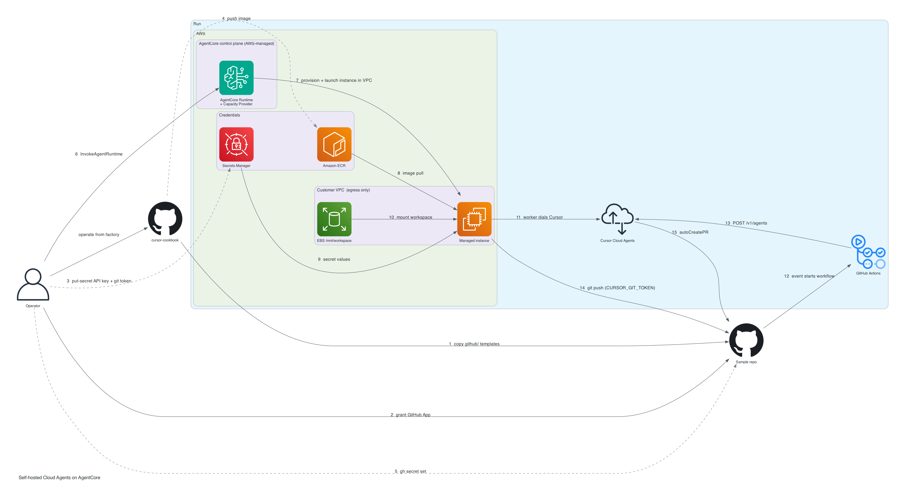

# AgentCore Runtime Guide

Use this README to understand the Amazon Bedrock AgentCore Runtime **Instances** architecture, operating model, validation expectations, and troubleshooting paths. Use [`terraform/README.md`](terraform/README.md) for the setup runbook with step-by-step commands.

Read [`REQUIREMENTS.md`](REQUIREMENTS.md) first if you want the design rationale, the citations behind every AWS claim, and the open questions. Nothing in this target has been deployed against a live AWS account.

This target is **self-contained**: it has its own `.env.example` and `Makefile`, and its Docker build context is this directory. Run commands from `self-hosted-cloud-agent/agentcore`, or `make agentcore-<target>` from `self-hosted-cloud-agent/` (that still reads `agentcore/.env`, not the parent `.env`).

## When To Use AgentCore Instances

Use this path when a customer is already standardizing agent workloads on AgentCore Runtime and wants the Cursor worker to live alongside their other agents, under the same control plane, IAM model, and observability. It also fits workloads that want a **persistent workspace**: the EBS volume survives a session stop, so a large clone and its build caches are still there when the session is invoked again.

Use ECS/Fargate or Kubernetes instead when you want a conventional long-running service. AgentCore has no service abstraction: a worker exists only after you call `InvokeAgentRuntime` for a specific session ID, there is no autoscaling loop, and sessions cannot be listed. Those constraints are the price of the AgentCore control plane, not incidental gaps.

Use AgentCore **microVMs** instead of Instances only if a worker that dies after 8 hours is acceptable. Instances is the right compute type here because it supports 14-day sessions, EBS volumes, session stop/restart, and instances that run in the customer's own account.

## Documentation Map

- This README: architecture, resource summary, security model, operations, validation, and troubleshooting.
- [`REQUIREMENTS.md`](REQUIREMENTS.md): the design problem, functional and non-functional requirements, IAM roles, quotas, acceptance criteria, and open questions.
- [`diagrams/architecture.png`](diagrams/architecture.png): simple component diagram (official AWS and GitHub icons, labeled edges). Regenerate with `python3 diagrams/render_architecture.py`.
- [`terraform/README.md`](terraform/README.md): command runbook — `.env` / `export`, Terraform, image publishing, session lifecycle, key rotation, and cleanup.
- [`diagrams/secrets-and-flow.png`](diagrams/secrets-and-flow.png): detailed secrets and env-var runbook (laptop `export`, GitHub Actions secrets, Terraform runtime env, adapter `GetSecretValue`, and the 15-step commands). Regenerate with `python3 diagrams/render_secrets_and_flow.py`.

## Quick Start

Run from `self-hosted-cloud-agent/agentcore`. The same `make agentcore-*` targets also work from `self-hosted-cloud-agent/`. Prerequisites, variable meanings, and validation live in [`terraform/README.md`](terraform/README.md).

1. Copy the GitHub templates into the application repository the worker should clone and PR against (not this cookbook), then grant the Cursor GitHub App access to that repo:

```bash
mkdir -p <app>/.github/workflows <app>/.github/scripts
cp github/cursor-agent-in-progress.yml <app>/.github/workflows/
cp github/kick_cursor_agent.py <app>/.github/scripts/
```

2. Configure `.env`:

```bash
cp .env.example .env
```

Fill in AWS credentials, a Cursor **service account** API key, the pool name, and `WORKER_REPOSITORY_URL` for that application repo.

3. Apply infrastructure, upload the key, push the image, and start a session:

```bash
make agentcore-terraform-init
make agentcore-terraform-apply
make agentcore-put-api-key-secret
make agentcore-ecr-build-push
make agentcore-start-session
```

Record the session ID the last command prints, then put it in `.env` (or export it) so later targets know which session to use:

```bash
export AGENTCORE_SESSION_ID=cursor-worker-<uuid>
```

4. Confirm the worker is up (`make agentcore-session-status` should show `"status": "HealthyBusy"`), then select the pool in Cursor Cloud Agents and dispatch a task.

## The Design Problem In One Paragraph

A Cursor self-hosted pool worker is a long-lived process that dials Cursor outbound and never serves a request. An AgentCore agent is a container that serves `GET /ping` and `POST /invocations` on `0.0.0.0:8080` and is driven by `InvokeAgentRuntime`. These are opposite shapes. The bridge is the ping status: `/ping` must return exactly `Healthy` or `HealthyBusy`, and a session reporting `HealthyBusy` is kept alive past the 15-minute idle timeout. The ping status *is* the keepalive — there is no separate keepalive API. So the adapter reports `HealthyBusy` for as long as the worker child process is alive, and the worker runs for the life of the session.

## What Gets Created

Terraform creates:

- One AgentCore **capacity provider** defining the operating system, allowed instance types, subnets, security group, a persistent EBS workspace volume, and lifecycle timers.
- One AgentCore **agent runtime** pointing at the worker image, referencing the capacity provider, and mounting the workspace volume at `/mnt/workspace`.
- One ECR repository for the worker image.
- One Secrets Manager secret container for the Cursor service account key.
- Three IAM roles: the capacity provider operator role, the instance role and its instance profile, and the runtime execution role.
- One security group with no inbound rules and outbound HTTPS/DNS.

Terraform creates only the Secrets Manager secret metadata. The service account key value is uploaded separately so it does not land in Terraform state.

Terraform does **not** create a session. Sessions come into existence only when you invoke the runtime; see [Operating Model](#operating-model).

The capacity provider and agent runtime are managed through `aws_cloudcontrolapi_resource` rather than native resources. `hashicorp/aws` has no capacity provider resource and no `capacity_provider_configuration` on its runtime resource; `hashicorp/awscc` has the capacity provider but a stale runtime schema. Both CloudFormation types are public and live with all five handlers, so Cloud Control API reaches the current schema at apply time. See §10 of [`REQUIREMENTS.md`](REQUIREMENTS.md).

## Architecture



The Operator sits outside the lanes. Configure is the sample repo (steps 1–2). Credentials is Secrets Manager and ECR (steps 3–5). Run is the session, registration, kickoff, and PR (steps 6–14). Step 1 copies the static templates in `github/` into the sample app (`.github/workflows/` and `.github/scripts/kick_cursor_agent.py`); the cookbook does not generate those files.

Detailed runbook (how to `export` / `.env` each variable, where it lands, and the 15-step commands): [`diagrams/secrets-and-flow.png`](diagrams/secrets-and-flow.png). Command sequence: [`terraform/README.md`](terraform/README.md).

[`adapter/worker_adapter.py`](adapter/worker_adapter.py) is the entrypoint instead of the worker CLI. It is standard library only, so the image gains no dependencies. On start it:

1. Starts the HTTP listener **before** the worker, so `/ping` answers immediately.
2. Reads the Cursor service account key from Secrets Manager with the runtime execution role.
3. Initializes `/mnt/workspace` as a git repository with `origin` set to `WORKER_REPOSITORY_URL`, idempotently, because the volume persists across session restarts and will already be initialized on the second start. Fetch and checkout are attempted but not required: the image has no Git credentials, so a private HTTPS remote must not block worker startup.
4. Forks `agent worker --pool ... start`, with the options before the `start` subcommand.
5. Reports `HealthyBusy` while that child is alive, and restarts it with backoff if it exits unexpectedly.

Two documented footguns are handled deliberately:

- **`time_of_last_update` advances only on a real status transition.** A timestamp that moves on every ping signals continuous change, which prevents the idle timeout from ever firing; sessions then live until `MaxLifetime` and can exhaust the session quota.
- **The ping path never blocks.** Health is served from a snapshot copied under a short lock while the child is supervised elsewhere. A blocked ping thread is the documented cause of sessions dying at exactly 15 minutes.

## Divergences From The EC2 And ECS Targets

These are deliberate, and each one is forced by the platform.

| Aspect | ec2 / ecs | agentcore | Reason |
| --- | --- | --- | --- |
| Worker directory | `/workspace` | `/mnt/workspace` | Volume mount paths must be under `/mnt` with exactly one subdirectory level |
| Container entrypoint | `agent worker` directly | adapter supervises it | The HTTP contract must be satisfied |
| Secret delivery | `--env-file` / task `secrets` | fetched at startup via the execution role | AgentCore has no native secret injection |
| Workspace persistence | none | EBS volume across session restarts | An Instances capability worth using |
| Scaling | ECS Service Auto Scaling | one worker per session, invoked explicitly | No service abstraction exists |
| Start trigger | service or host boot | `InvokeAgentRuntime` | Sessions exist only after invocation |
| Architecture | `linux/amd64` default | `linux/arm64` | See below |
| Terraform resources | native `aws_*` | plus `aws_cloudcontrolapi_resource` | Provider gap |
| Configuration | shared `../.env` and `../Makefile` | own `.env` and `Makefile` | This target is self-contained |

**On architecture.** Build `linux/arm64`. The Instances compute page lists x86_64 and arm64 support, but four container-contract pages state ARM64 without qualification, and no page states that the image architecture may differ from the capacity provider's `operatingSystem`. arm64 is the only choice that is safe under both readings. This is [OQ-1](REQUIREMENTS.md) and the most consequential open question in this target. If you verify that x86_64 images are accepted, set `WORKER_PLATFORM=linux/amd64` and `AGENTCORE_OPERATING_SYSTEM=LINUX_X86_64` together — they must match.

## Network And Security Model

- The worker connects outbound to Cursor over HTTPS. No inbound access is required.
- The security group has no inbound rules. Egress is HTTPS and DNS only.
- An Instances runtime does **not** take a `networkConfiguration`. It inherits networking from the capacity provider, and passing both fails with `ValidationException`.
- Instances is VPC-only. There is no `PUBLIC` network mode as there is for microVMs.
- `metadataConfiguration` is **not** set, because it cannot be. The docs say the service has rejected invocations targeting runtimes without it since June 30, 2026, but the property is absent from the live CloudFormation Runtime schema and from `CreateAgentRuntime` — only `UpdateAgentRuntime` accepts it, where the CLI documents it as *microVM* Metadata Service configuration. The likeliest reading is that this applies to microVM runtimes and that Instances is governed by EC2 IMDSv2 on the managed instance. This is the second-largest first-run risk after the image architecture; see [OQ-10](REQUIREMENTS.md) and the troubleshooting entry below.
- Both the workspace volume and the root volume are encrypted. Encryption is fixed at volume creation.
- One worker per session. Instances allows up to 20 agents per session, but agents that share an instance share a filesystem and credentials — "any code running on the instance can read the credentials available to it" and "all agents that share an instance must be mutually trusted." Running one worker per session keeps one Cursor task from reading another's credentials or workspace.
- The runtime execution role can pull from the worker ECR repository, read only the configured Cursor API key secret, write runtime logs, publish traces, and publish metrics in the `bedrock-agentcore` namespace.
- The instance role exists only so AgentCore can collect instance system logs. It grants nothing to agent code.

For private subnets, make sure the subnet has NAT or equivalent egress to reach Cursor, ECR, and Secrets Manager.

## Operating Model

There is no service and no autoscaling loop. The unit of work is a **session**, and the session ID is the only handle you get:

```bash
make agentcore-start-session      # invokes the runtime, prints a session ID
make agentcore-session-status     # reports the worker state from inside the session
make agentcore-stop-session       # stops the agent runtime; the EC2 instance stays
make agentcore-delete-session     # terminates the instance and deletes the workspace volume
make agentcore-list-instances     # the closest thing to listing sessions
```

Two properties of this model matter in practice.

**Sessions cannot be listed.** Session IDs are values you supply on invocation, and there is no operation that lists the sessions on a capacity provider. Record the ID that `agentcore-start-session` prints — put it in `.env` as `AGENTCORE_SESSION_ID`. If you lose it, `make agentcore-list-instances` finds the managed instances backing live sessions, but managed instances are hidden from default EC2 views, which is why that target passes `--include-managed-resources`.

**Invoking an existing session ID routes to the same instance,** and restarts it if it was stopped with `StopRuntimeSession`. That is what makes the persistent workspace useful, and it also means `agentcore-session-status` will wake a stopped session. Use it only on sessions you want running. `make agentcore-delete-session` is different: it calls `DeleteCapacityProviderSession`, which terminates the instance and deletes the volume. That session ID cannot be reused.

To scale to N workers, invoke N distinct session IDs. Each gets its own instance and its own workspace volume.

Session IDs must be at least 33 characters. The scripts generate `cursor-worker-<uuid>`, which satisfies that.

Changing instance types, networking, or storage on the capacity provider **replaces** it. `ComputeConfiguration` is create-only; only `Description` and `Tags` update in place. A replacement cascades to the runtime and destroys the sessions and their persistent volumes. Plan those changes as migrations, not edits.

After changing the adapter or the Dockerfile, publish a new image and start a fresh session. A running session does not pull a new image.

### GitHub Project Kickoff (`agent-*` issues)

`github/` in this lab is a **template**. Copy it into the application repository the pool worker should clone and PR against — not into this cookbook. **Kaushalavardhanam** (`kaushalavardhanam/kaushalavardhanam` and [org project 1](https://github.com/orgs/kaushalavardhanam/projects/1)) is the sample application used to exercise the lab. Point `WORKER_REPOSITORY_URL`, the workflow `PROJECT_*` env, and the Cursor GitHub App at your own repo when you are not running that sample.

Issues whose title starts with `agent-` are picked up when they move to **In Progress** on that application’s project board. The workflow in the application repo launches a Cloud Agent on pool `agentcore-platform-agents` with `autoCreatePR` against `main`.

A project board does not fire a GitHub Actions event on drag, so the workflow polls every five minutes. It also starts immediately if you add the `in-progress` label or run the workflow manually. `GH_PROJECT_TOKEN` must be able to read that board’s Projects v2.

The AgentCore session must already be `HealthyBusy` or the job sits in the pool until a worker registers.

## Validation

A healthy deployment has:

- A capacity provider in `READY` state and an agent runtime in `READY` state.
- One managed EC2 instance per live session, visible through `make agentcore-list-instances`.
- `/ping` reporting `HealthyBusy`, which is what keeps the session alive.
- Runtime logs showing registration to the expected pool and repo.
- The self-hosted pool visible and selectable in Cursor Cloud Agents.
- Cursor GitHub App access granted to the target repository.

Check the contract locally before spending any AWS resources:

```bash
make agentcore-docker-build
make agentcore-contract-test
```

That asserts `/ping` answers 200 with a valid status, that `time_of_last_update` does not advance while the status is unchanged, and that `/invocations` reports worker state. With a real `CURSOR_API_KEY` in `.env` it also waits for the status to reach `HealthyBusy`.

Check a live session:

```bash
make agentcore-session-status
make agentcore-logs
```

A healthy worker log includes:

```text
Worker is now running
Registering to worker pool
Repo: <owner>/<repo>
Pool: <pool-name>
```

The keepalive itself is only proven by time: leave a session idle for more than 15 minutes and confirm it is still running.

## Troubleshooting

### Instances Still Appear After `agentcore-stop-session`

Expected. `StopRuntimeSession` stops the worker inside the session. On Instances the EC2 box stays until `IdleInstanceTimeout` (900 seconds in this lab) or until you delete the capacity-provider session:

```bash
make agentcore-delete-session SESSION_ID="$AGENTCORE_SESSION_ID"
```

That call is asynchronous. `make agentcore-list-instances` should drop to `[]` once the instance reaches `terminated`. Each extra instance is a different session ID; delete each one, or `make agentcore-terraform-destroy` if you no longer have the IDs.

If `delete-session` returns `CapacityProviderSession not found`, that ID is already gone. Leftover EC2 instances are almost always **earlier lab sessions**. AgentCore tags them with `bedrock-agentcore:runtime-session-id`, which is often a bare UUID — not `cursor-worker-<uuid>`. `make agentcore-list-instances` prints `RuntimeSessionId`. Delete that value, or all of them:

```bash
make agentcore-delete-session SESSION_ID=<RuntimeSessionId>
make agentcore-delete-listed-sessions
```

Do not run `make agentcore-session-status` on those old IDs unless you want to wake the session.

Deleting a session also deletes its persistent EBS volume. The session ID cannot be reused. Use stop-then-start with the same ID only when you want to keep `/mnt/workspace`.

### The Session Dies At Exactly 15 Minutes

The ping path is blocked or reporting `Healthy`. A session is kept alive past the idle timeout only while it reports `HealthyBusy`, and the documented cause of this failure is a single-threaded application that blocks the ping thread.

Confirm what the adapter is reporting:

```bash
make agentcore-session-status
```

If `worker.running` is `false`, the worker exited and the adapter dropped back to `Healthy` on purpose, making the session idle-eligible. Look at `worker.last_exit_code` and `worker.last_error`, then check the runtime logs.

### Sessions Never Expire And The Quota Fills Up

The inverse footgun. If `time_of_last_update` advances on every ping, the service sees continuous change, the idle timeout never fires, and sessions persist until `MaxLifetime` — up to 14 days with the default configuration here. The adapter advances that timestamp only on a real status transition; `make agentcore-contract-test` asserts it.

Because sessions cannot be listed, use `make agentcore-list-instances` to find what is still running, and `make agentcore-stop-session` on each session ID.

### `CreateAgentRuntime` Fails On Lifetime

Runtime `maxLifetime` must be less than or equal to the capacity provider's `maxLifetime`. The runtime default is 28800 seconds (8 hours), so a long-lived worker has to raise it explicitly. `AGENTCORE_MAX_LIFETIME` in `.env` sets both, which keeps them consistent.

### `ValidationException` Mentioning Network Configuration

An Instances runtime must not receive a `networkConfiguration`; it inherits networking from the capacity provider. The Terraform here omits it deliberately. If you add it back, this is the error you get.

### Invocations Are Rejected And The Runtime Looks Fine

Suspect `metadataConfiguration`. The docs say invocations targeting runtimes without it have been rejected since June 30, 2026, and this Terraform cannot set it at create time — the property is absent from the CloudFormation Runtime schema and from `CreateAgentRuntime`.

If that is the cause, set it after the fact with the one API that does accept it:

```bash
aws bedrock-agentcore-control update-agent-runtime \
  --profile "$AWS_PROFILE" --region "$AWS_REGION" \
  --agent-runtime-id "$(terraform -chdir=terraform output -raw agent_runtime_arn | cut -d/ -f2)" \
  --metadata-configuration 'requireMMDSV2=true'
```

Then re-invoke. Note that Terraform will not know about that change, so re-record the outcome in [OQ-10](REQUIREMENTS.md) and decide whether to keep the call as a documented post-apply step.

### HTTP 424 At Session Start

Either the overlay mount failed or the container did not answer the health probe. More than 53 image layers combined with a non-numeric `USER` directive causes an overlay mount failure. Keep the image under 53 layers, or use a numeric `USER`. The image must also stay under 2 GB.

### Image Pull Fails Or The Container Will Not Start

Confirm the image exists in ECR, the tag matches `WORKER_IMAGE_TAG`, and the image architecture matches the capacity provider's `operatingSystem`. `LINUX_ARM64` needs `linux/arm64`. A mismatch here is the most likely first-run failure; see [OQ-1](REQUIREMENTS.md).

### The Adapter Cannot Read The Secret

The adapter fetches the key with the runtime execution role because AgentCore has no `valueFrom`-style secret injection. Confirm the secret has a value:

```bash
make agentcore-put-api-key-secret
```

An empty secret produces `secret <id> is empty. Upload the service account key first.` in the runtime logs.

### API Key Is Invalid

Pool workers require a Cursor **service account API key**. Normal user, member, team, personal, or organization API keys are rejected.

Create the key from Cursor's Service Accounts settings, update `.env`, upload the new value, and start a fresh session.

### Worker CLI Rejects Arguments

The worker options belong before the `start` subcommand. `build_command()` in the adapter follows the correct ordering; preserve it if you edit it.

### Worker Logs `Repo: (repo unavailable)`

The adapter can set `origin` correctly and still fail routing. Cursor matches a pool job to a worker with both `pool=` and `repo=` labels. `Repo: (repo unavailable)` means the CLI did not derive `repo=owner/repo` from `/mnt/workspace`, so a Cloud Agent for that GitHub repo waits with **No self-hosted workers are connected** even while `/ping` is `HealthyBusy`.

Confirm the next session logs `Repo: kaushalavardhanam/kaushalavardhanam` (or your owner/repo), not `(repo unavailable)`. The adapter now passes `--label repo=...` from `WORKER_REPOSITORY_URL` and sets `safe.directory` so the CLI can read origin on an AgentCore volume. Publish a new image and start a **new** session; a running session does not pick up the image.

The `http code 400, message Bad request syntax ('13')` line is AgentCore sending a non-HTTP probe to port 8080. It is unrelated to pool registration.

### Worker Directory Is Not A Git Repo

Cursor derives the repo label from the worker directory's git remote, and startup fails without it. The adapter initializes `/mnt/workspace` and sets `origin` to `WORKER_REPOSITORY_URL`. If that variable is empty the adapter logs `WORKER_REPOSITORY_URL is unset, skipping git initialization` and the worker will fail to register.

Because the volume persists, a session that once had the wrong remote keeps it. The adapter resets `origin` on every start so a stale remote converges.

A failed `git fetch` is not fatal. The image has no Git credentials, so a private `https://github.com/...` URL cannot be cloned at startup. Sibling EC2, ECS, and EKS targets only set the remote; this adapter matches that contract and still launches `agent worker`. Clone the repo with `--clone-git-repos` (and a minted GitHub token) if the agent needs a full checkout.

### Cloud Agents Cannot Access The Repo

A connected worker is not enough. Cursor Cloud Agents also needs GitHub App access to the target repository. Install or update the Cursor GitHub App for the repo owner, grant access to the repository, save the GitHub App settings, and refresh the Cloud Agents page.

### Cloud Control Rejects A Property

The Cloud Control escape hatch resolves the CloudFormation schema at apply time, so a schema older than the API surfaces as a rejected property rather than a silently dropped one. Every property in the two `desired_state` blocks was checked against the live schemas, but the schemas move. Compare the failing property against the current one:

```bash
aws cloudformation describe-type \
  --type RESOURCE \
  --type-name AWS::BedrockAgentCore::Runtime \
  --query 'Schema' --output text | jq .
```

### The Region Does Not Support Instances

AgentCore Runtime Instances is available in us-east-1, us-east-2, us-west-2, eu-central-1, eu-west-1, ap-south-1, ap-southeast-1, ap-southeast-2, and ap-northeast-1. It is not available in us-west-1, eu-west-2, ca-central-1, sa-east-1, GovCloud, or several others. The `aws_region` variable validates against the supported list rather than failing at apply time.

## Cleanup

```bash
make agentcore-stop-session       # for each session ID you started; does not kill EC2
make agentcore-delete-session     # for each session ID; terminates the instance and volume
make agentcore-terraform-destroy
```

Destroying the capacity provider stops and deletes its sessions **and their persistent storage**. That is the only way to reclaim the workspace volumes, and it is not reversible.

Confirm nothing is left behind afterwards, because managed instances are hidden from default EC2 views and remain billable while they run:

```bash
make agentcore-list-instances
```

Because this lab sets the ECR repository to force-delete, Terraform can remove the repository even if it contains demo images.
